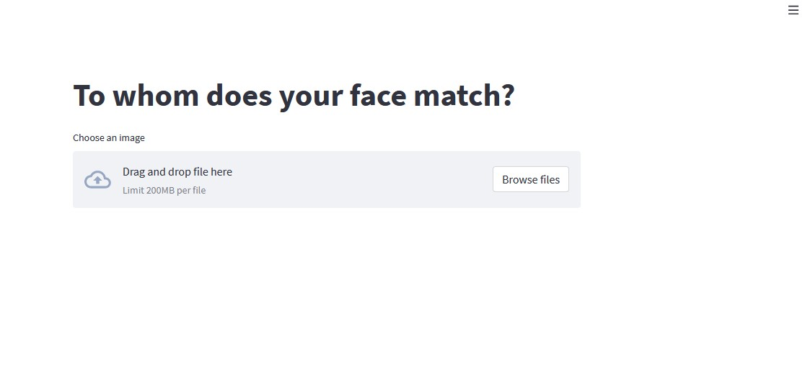
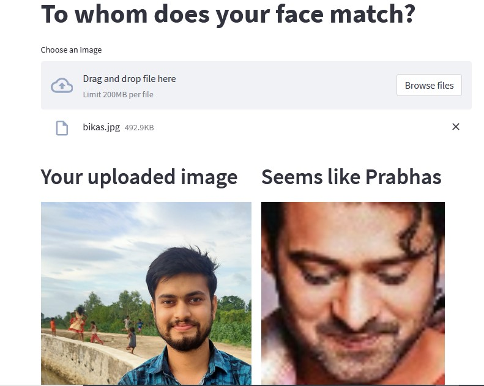

# Project Name: Face Match

This project use a deeplearning model like **VGGFace** and to build a web application **Streamlit** is used.

Face recognition is the problem of identifying and verifying people in a photograph by their face.
It is a task that is trivially performed by humans, even under varying light and when faces are changed by age or obstructed with accessories and facial hair. Nevertheless, it is remained a challenging computer vision problem for decades until recently.

Deep learning methods are able to leverage very large datasets of faces and learn rich and compact representations of faces, allowing modern models to first perform as-well and later to outperform the face recognition capabilities of humans.

In this project, you will discover the problem of face recognition and how deep learning methods can achieve superhuman performance to identify similar faces.


## Demo Video:


This is a methods of identifying similar faces check various aspects on pictures, including: face shape, nose, eyes and mouth; face position in the picture; skin color (including the lighting of the photo); color and hair and cosine_similarity.

# Dataset
Dataset for this project is used from 

# Model Used to Predict 
Here I used VGGFace model to extract the facial features.

# Webapp Building 
Here Streamlit is used to develop the web application and deployed in a local server.

# Some Real Time Demo:

Web app look



Lets check some of images



This really performing good you can consider by seeing this result 😀

# STEPS to run this project:

You can also use others images instead of bollywood actress

## STEP 01: 
Clone the repository

```bash
git clone https://github.com/dipesg/face_match.git
```

## STEP 02: 
Create an environment


```bash
conda create -n celebrity python=3.7 -y
```

## STEP 03: 
Install the requirements


```bash
pip install -r requirements.txt
```

## STEP 04: 
Download the data from the link and keep it in your project directory. Make sure all the actress folder should be in just one folder called data, like that


## STEP 05: 
Just execute this command one time if you are not changing the data


```bash
python run.py
```

## STEP 06: 
Now to start the webapp run the following command


```bash
streamlit run app.py
```


